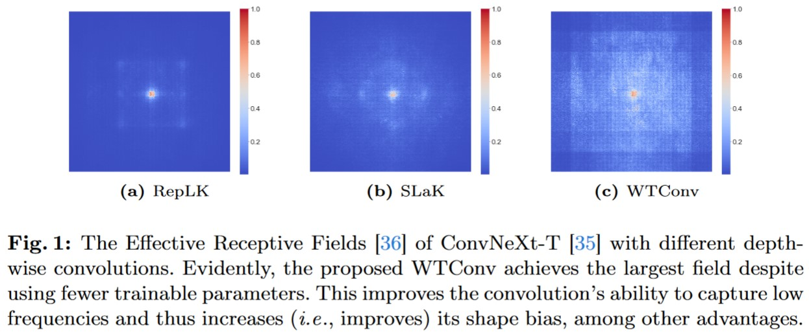
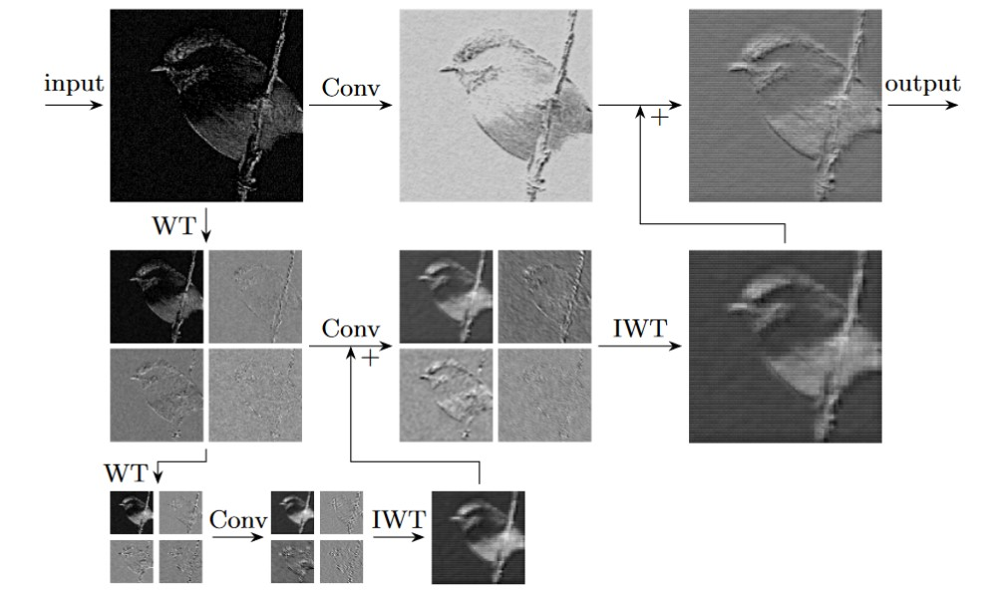

<!-- # WTConv
## Wavelet Convolutions for Large Receptive Fields. ECCV 2024. -->
# Wavelet Convolutions for Large Receptive Fields [ECCV 2024]

[Shahaf E. Finder](https://shahaffind.github.io/), [Roy Amoyal](https://www.linkedin.com/in/roy-amoyal/), [Eran Treister](https://www.cs.bgu.ac.il/~erant/), and [Oren Freifeld](https://www.cs.bgu.ac.il/~orenfr/)

[](https://arxiv.org/abs/2407.05848)

<p align="center">

</p>

<details>
<summary> WTConv illustration </summary>
<p align="center">

</p>
</details>

### Requirements
- Python 3.12
- timm 1.0.7
- PyWavelets 1.6.0

### How to use
You can import WTConv and use it in your CNN
```python
from wtconv import WTConv2d

conv_dw = WTConv(32, 32, kernel_size=5, wt_levels=3)
```
Or you can use WTConvNeXt through timm's model registry
```python
import wtconvnext

model = create_model(
    "wtconvnext_tiny",
    pretrained=False,
    num_classes=1000
)
```


## Results and Trained Models
### ImageNet-1K
| name | resolution |acc@1 | #params | FLOPs | model |
|:---:|:---:|:---:|:---:| :---:|:---:|
| WTConvNeXt-T | 224x224 | 82.5 | 30M | 4.5G | [model](https://drive.google.com/file/d/1wMgUUJBAs4Fz2dZoNS7QCk9kMB8MPMtC/view?usp=drive_link) |
| WTConvNeXt-S | 224x224 | 83.6 | 54M | 8.8G | [model](https://drive.google.com/file/d/1F5yo1nSbCvUH8lQXTM1pdK4T_W_2PmFQ/view?usp=drive_link) |
| WTConvNeXt-B | 224x224 | 84.1 | 93M | 15.5G | [model](https://drive.google.com/file/d/1snpt4L38NB8vIhKRcelylj0guGd0Q7q7/view?usp=drive_link) |

## Training and Validating WTConvNeXt
### Training WTConvNeXt on ImageNet-1k
You can use this script, taken from the timm library, to train WTConvNeXt-T:

```sh
python train.py --model wtconvnext_tiny --drop-path 0.1 \
                --data-dir IMAGENET_PATH \
                --epochs 300 --warmup-epochs 20 \
                --batch-size 64 --grad-accum-steps 64 --sched-on-updates \
                --lr 4e-3 --weight-decay 5e-2 \
                --opt adamw --layer-decay 1.0 \
                --aa rand-m9-mstd0.5-inc1 \
                --reprob 0.25 --mixup 0.8 --cutmix 1.0 \
                --model-ema --model-ema-decay 0.9999 \
                --output checkpoints/wtconvnext_tiny_300/
```

You can use `torchrun` to distribute the training, just note that the effective batch size should be 4096 (gpus * batch-size * grad-accum-steps = 4096).  
E.q., we've trained the network using a single machine with 4 GPUs, hence set batch-size to 64 and grad-accum-steps to 16.

```sh
torchrun --nproc-per-node=4  \
         python train.py --model wtconvnext_tiny --drop-path 0.1 \
                --data-dir IMAGENET_PATH \
                --epochs 300 --warmup-epochs 20 \
                --batch-size 64 --grad-accum-steps 16 --sched-on-updates \
                --lr 4e-3 --weight-decay 5e-2 \
                --opt adamw --layer-decay 1.0 \
                --aa rand-m9-mstd0.5-inc1 \
                --reprob 0.25 --mixup 0.8 --cutmix 1.0 \
                --model-ema --model-ema-decay 0.9999 \
                --output checkpoints/wtconvnext_tiny_300/
```

Other network sizes:

<details>
<summary> WTConvNeXt-S </summary>
Single GPU

```
python train.py --model wtconvnext_small --drop-path 0.4 \
                --data-dir IMAGENET_PATH \
                --epochs 300 --warmup-epochs 20 \
                --batch-size 64 --grad-accum-steps 64 --sched-on-updates \
                --lr 4e-3 --weight-decay 5e-2 \
                --opt adamw --layer-decay 1.0 \
                --aa rand-m9-mstd0.5-inc1 \
                --reprob 0.25 --mixup 0.8 --cutmix 1.0 \
                --model-ema --model-ema-decay 0.9999 \
                --output checkpoints/wtconvnext_tiny_300/
```

Multi-GPU
```
torchrun --nproc-per-node=4  \
         python train.py --model wtconvnext_small --drop-path 0.1 \
                --data-dir IMAGENET_PATH \
                --epochs 300 --warmup-epochs 20 \
                --batch-size 64 --grad-accum-steps 16 --sched-on-updates \
                --lr 4e-3 --weight-decay 5e-2 \
                --opt adamw --layer-decay 1.0 \
                --aa rand-m9-mstd0.5-inc1 \
                --reprob 0.25 --mixup 0.8 --cutmix 1.0 \
                --model-ema --model-ema-decay 0.9999 \
                --output checkpoints/wtconvnext_tiny_300/
```

</details>

<details>
<summary> WTConvNeXt-B </summary>
Single GPU

```
python train.py --model wtconvnext_base --drop-path 0.4 \
                --data-dir IMAGENET_PATH \
                --epochs 300 --warmup-epochs 20 \
                --batch-size 64 --grad-accum-steps 64 --sched-on-updates \
                --lr 4e-3 --weight-decay 5e-2 \
                --opt adamw --layer-decay 1.0 \
                --aa rand-m9-mstd0.5-inc1 \
                --reprob 0.25 --mixup 0.8 --cutmix 1.0 \
                --model-ema --model-ema-decay 0.9999 \
                --output checkpoints/wtconvnext_tiny_300/
```

Multi-GPU

```
torchrun --nproc-per-node=4  \
         python train.py --model wtconvnext_base --drop-path 0.5 \
                --data-dir IMAGENET_PATH \
                --epochs 300 --warmup-epochs 20 \
                --batch-size 64 --grad-accum-steps 16 --sched-on-updates \
                --lr 4e-3 --weight-decay 5e-2 \
                --opt adamw --layer-decay 1.0 \
                --aa rand-m9-mstd0.5-inc1 \
                --reprob 0.25 --mixup 0.8 --cutmix 1.0 \
                --model-ema --model-ema-decay 0.9999 \
                --output checkpoints/wtconvnext_tiny_300/
```

</details>

### Evaluating WTConvNeXt on ImageNet-1k
You can use this script, taken from the timm library, to validate the results:
```
python validate.py --model wtconvnext_tiny \
                   --data-dir IMAGENET_PATH \
                   --checkpoint WTConvNeXt_tiny_5_300e_ema.pth
```

## Acknowledgement
The code for WTConvNeXt, as well as the training and validating scripts, were adapted from the [timm](https://github.com/rwightman/pytorch-image-models) library.

## License
This project is released under the MIT license. Please see the [LICENSE](LICENSE) file for more information.

## Citation
If you find this repository helpful, please consider citing:
```
@inproceedings{finder2024wavelet,
  title     = {Wavelet Convolutions for Large Receptive Fields},
  author    = {Finder, Shahaf E and Amoyal, Roy and Treister, Eran and Freifeld, Oren},
  booktitle = {European Conference on Computer Vision},
  year      = {2024},
}
```
